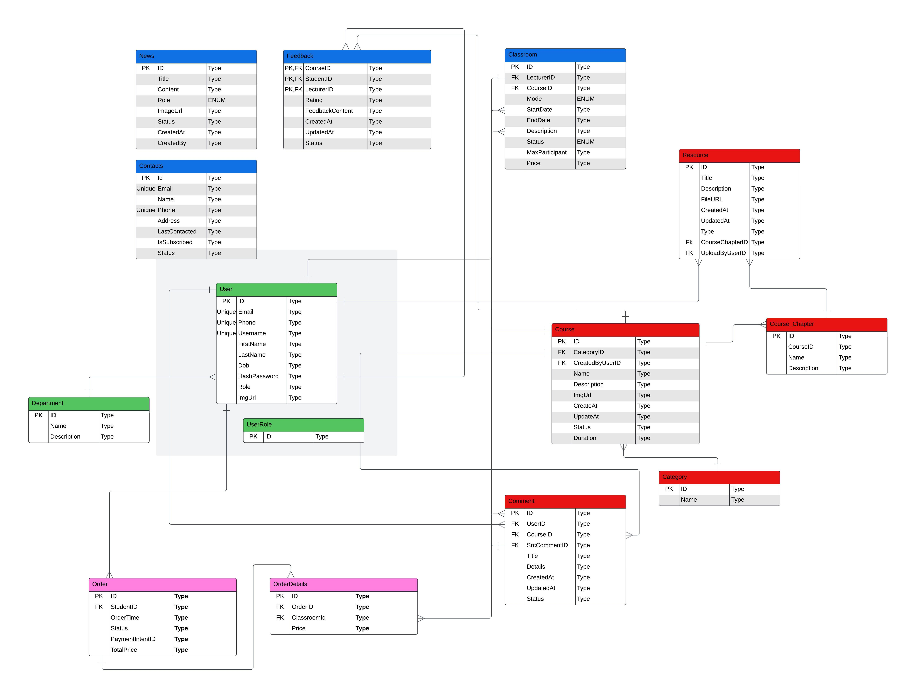

# Doreamon - Online Learning Platform

    
Doreamon is an online learning platform providing healthcare related courses to study online and offline.

 
 
 
 
 

 

## Table of Contents
<ol start="0"> 
    <li><a href="#intro">Introduction</a></li>
    <li><a href="#tech">Tech Stacks</a></li>
    <li><a href="#uc-diagram">Entity Relationship Diagram</a></li>
    <li><a href="#team-members">Team Members</a></li>
</ol>

## 0. Introduction
An online platform for healthcare education. Access expert-led courses, learn at your own pace, and stay updated with the latest in medical knowledge—anytime, anywhere.

## Core Features

- **Buy the Course and Participate in Online/Offline Courses**: Students can purchase and enroll in structured psychological programs available both online and offline.

- **Course Management System**: Schools can offer up to three free Supporting Programs (e.g., mental health, anxiety, resilience) through workshops and webinars led by licensed psychologists.

- **Account Management System**: Students can manage their profiles and book one-on-one counseling sessions with certified mental health professionals.

- **Live Classroom**: Enables secure, real-time messaging between students and an AI chatbot for ongoing emotional support.

- **Payment System**: Supports secure transactions and provides access to a curated library of self-help materials, articles, and exercises.

## Target Users

- **Primary Users**:
  - Admin
  - Staffs
  - Students
  - Lecturers
    

## 1. Tech Stacks

## 🖥️ Client & Server Technologies  

| Client | Description | Server | Description |
|--------|-------------|--------|-------------|
|  | Markup language for the web |  | Backend framework for MVC web apps |
|  | CSS framework for responsive UI |  | Server-side rendering view engine |
|  | Simple JavaScript charting library |  |  |
|  | Modern charting library | | |

---

## Database & Deployment  

The **Database** stack includes data storage solutions, while **API Deployment** contains tools for containerization, automation, and cloud services.  

| Database | Description | API Deployment | Description |
|----------|------------|---------------|------------|
|  | Relational database |  | Containerization platform |
|  | In-memory caching database | | Local development tunneling |

---

## Others  

Additional services and third-party APIs that enhance functionality, such as AI, payments, video streaming, and file storage.  

| Service | Description |
|---------|------------|
|  | Online payment processing |
|  | Peer-to-peer video streaming |
|  | Image and video storage |

## 2. Entity Relational Diagram

## 3. Team members
- [Lam Tieu My](https://github.com/meewaldor): Project Leader, Developer
- [Vu Kim Duy](https://github.com/AnonyFriday): Developer
- [Phan Tuan Dat](https://github.com/imbatcat): Developer
- [Nguyen Tuan Anh](https://github.com/Jeralith): Developer
